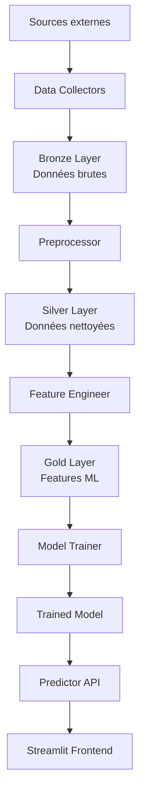

# 📐 Architecture Technique - ATP Prediction

## 🎯 Vue d'ensemble

Système de prédiction de matchs de tennis ATP basé sur une architecture moderne et scalable, suivant les best practices de l'industrie du Machine Learning.

---

## 🏛️ Principes d'architecture

### 1. **Separation of Concerns**
- Chaque module a une responsabilité unique et bien définie
- Découplage entre collecte de données, preprocessing, feature engineering, et modélisation
- Interface claire entre les couches

### 2. **Medallion Architecture (Bronze/Silver/Gold)**
- **Bronze**: Données brutes, immutables, source de vérité
- **Silver**: Données nettoyées, validées, dédupliquées
- **Gold**: Features ML, agrégations, prêtes pour l'entraînement

### 3. **Configuration as Code**
- Un seul fichier YAML pour toute la configuration
- Pas de variables en dur dans le code
- Facilite le changement d'environnement (dev/staging/prod)

### 4. **Logging structuré**
- Logs avec niveaux (DEBUG, INFO, WARNING, ERROR)
- Rotation automatique des fichiers de logs
- Traçabilité complète du pipeline

---

## 📊 Pipeline de données



### Étape 1 : Collecte (Bronze)

**Modules :**
- `ATPDataCollector`: Télécharge matchs depuis Jeff Sackmann GitHub
- `ClimateDataCollector`: Récupère données météo via Open-Meteo API

**Sorties :**
- `data/bronze/atp_matches_bronze.csv`
- `data/bronze/climate_bronze.csv`

**Caractéristiques :**
- Cache local pour éviter les re-téléchargements
- Retry automatique en cas d'échec
- Rate limiting pour respecter les APIs

### Étape 2 : Preprocessing (Silver)

**Module :** `ATPDataPreprocessor`

**Transformations :**
1. ✅ Suppression Davis Cup
2. ✅ Mapping tournois → villes
3. ✅ Filtrage tournois autorisés
4. ✅ Conversion dates
5. ✅ Renommage colonnes (winner/loser → P1/P2)
6. ✅ Suppression colonnes inutiles
7. ✅ Augmentation de données (inversion P1/P2)
8. ✅ Filtrage joueurs (≥10 matchs)

**Sortie :**
- `data/silver/atp_matches_silver.csv`

### Étape 3 : Feature Engineering (Gold)

**Module :** `ATPFeatureEngineer`

**Features créées :**

#### 📈 ELO Ratings
```python
# Calcul dynamique du rating ELO
elo_new = elo_old + K * (actual - expected)
where expected = 1 / (1 + 10^((elo_opponent - elo_player) / 400))
```

#### 🔄 Moyennes glissantes (5 derniers matchs)
- Ranking ATP
- Points de classement
- Aces, double fautes
- Statistiques de service (1st serve %, 2nd serve won, etc.)
- Break points sauvés

#### 🤝 Head-to-Head
- Nombre total de confrontations
- Victoires P1 vs P2
- Ratio de victoire H2H

#### 🎾 Performance par surface
- Win rate sur Hard
- Win rate sur Clay
- Win rate sur Grass

#### 📅 Features temporelles
- Année
- Mois
- Jour de l'année

**Sortie :**
- `data/gold/atp_matches_gold.csv` (85+ features)

---

## 🤖 Stratégie de modélisation

### Approche choisie : Modèle unique unifié

**Pourquoi pas un modèle par joueur ?**

| Critère | Modèle par joueur ❌ | Modèle unifié ✅ |
|---------|---------------------|------------------|
| Cold start | Impossible pour nouveaux joueurs | Généralisable |
| Maintenance | 1000+ modèles à gérer | 1 seul modèle |
| Données | Insuffisantes pour certains joueurs | Mutualisation des données |
| Scalabilité | Très difficile | Native |
| Entraînement | Très long (×1000) | Rapide |

**Comment le modèle unifié fonctionne :**

Le modèle apprend des **patterns généraux** du tennis :
- Joueur avec meilleur ELO gagne plus souvent
- H2H favorise le joueur dominant historiquement
- Surface préférée = avantage statistique
- Forme récente (moyennes glissantes) impacte le résultat

Le modèle **ne mémorise pas les joueurs**, il apprend les **relations entre features**.

### Algorithmes

#### 1. Gradient Boosting (Recommandé) ⭐
```yaml
model:
  algorithm: "gradient_boosting"
  hyperparameters:
    n_estimators: 200
    learning_rate: 0.1
    max_depth: 5
    min_samples_split: 20
```

**Avantages :**
- ✅ Très performant (~72-75% accuracy)
- ✅ Gère bien les features numériques
- ✅ Robuste au bruit
- ✅ Interprétable (feature importance)

#### 2. Random Forest
```yaml
model:
  algorithm: "random_forest"
  hyperparameters:
    n_estimators: 100
    max_depth: 10
```

**Avantages :**
- ✅ Stable (~68-72% accuracy)
- ✅ Pas d'overfitting
- ✅ Parallélisable

#### 3. Logistic Regression
```yaml
model:
  algorithm: "logistic_regression"
  hyperparameters:
    C: 1.0
    max_iter: 1000
```

**Avantages :**
- ✅ Simple et rapide
- ✅ Interprétable
- ⚠️  Moins performant (~65-70% accuracy)

#### 4. KNN
```yaml
model:
  algorithm: "knn"
  hyperparameters:
    n_neighbors: 5
```

**Avantages :**
- ✅ Simple conceptuellement
- ⚠️  Performances limitées (~60-65% accuracy)
- ⚠️  Lent en prédiction

---

## 🌐 API et Frontend

### Architecture 3-tiers

```
┌─────────────────┐
│   Frontend      │  Streamlit (Port 8501)
│   (Streamlit)   │  Interface utilisateur
└────────┬────────┘
         │
         │ HTTP
         │
┌────────▼────────┐
│   Backend       │  FastAPI (Port 8000)
│   (FastAPI)     │  API REST
└────────┬────────┘
         │
         │ Direct Call
         │
┌────────▼────────┐
│   ML Model      │  Predictor
│   (Scikit)      │  Inférence
└─────────────────┘
```

### Streamlit Frontend

**Fonctionnalités :**
- 🎾 Sélection de 2 joueurs (liste déroulante)
- 🔮 Calcul des probabilités de victoire
- 📊 Statistiques récentes (5-20 derniers matchs configurables)
- 📈 Graphiques interactifs (Plotly)
  - Évolution ELO dans le temps
  - Performance par surface
  - Comparaison head-to-head
- 🎨 Design moderne et responsive
- ⚡ Cache pour performances optimales

**Technologies :**
- Streamlit 1.29+
- Plotly (visualisations interactives)
- Pandas (manipulation données)

### FastAPI Backend (optionnel)

**Endpoints :**
```python
GET  /api/v1/players               # Liste tous les joueurs
GET  /api/v1/player/{name}/stats   # Stats d'un joueur
POST /api/v1/predict               # Prédire un match
GET  /api/v1/model/info            # Info sur le modèle
```

**Technologies :**
- FastAPI
- Pydantic (validation)
- Uvicorn (ASGI server)

---

## 🔄 Pipeline d'automatisation

### Microsoft Fabric (Recommandé)

**Pourquoi Fabric vs Databricks ?**

| Critère | Fabric ✅ | Databricks |
|---------|-----------|------------|
| Coût mensuel | ~$50-100 | ~$200-500 |
| Setup | Simple | Complexe |
| Intégration Azure | Native | Bonne |
| Lakehouse intégré | Oui | Non (Delta Lake séparé) |

**Architecture Fabric :**

```
┌──────────────────────────────────────┐
│        Data Ingestion                │
│  ┌────────────────────────────────┐  │
│  │ Jeff Sackmann API (Daily)     │  │
│  │ Open-Meteo API (Weekly)       │  │
│  └────────────┬───────────────────┘  │
│               │                       │
│               ▼                       │
│  ┌────────────────────────────────┐  │
│  │ Kafka Topic (optional)        │  │
│  │ atp-matches-raw               │  │
│  └────────────┬───────────────────┘  │
│               │                       │
│               ▼                       │
│  ┌────────────────────────────────┐  │
│  │ Fabric Lakehouse              │  │
│  │ ├─ Bronze (Raw)               │  │
│  │ ├─ Silver (Cleaned)           │  │
│  │ └─ Gold (Features)            │  │
│  └────────────┬───────────────────┘  │
│               │                       │
│               ▼                       │
│  ┌────────────────────────────────┐  │
│  │ Fabric Notebook               │  │
│  │ (Weekly model retraining)     │  │
│  └────────────┬───────────────────┘  │
│               │                       │
│               ▼                       │
│  ┌────────────────────────────────┐  │
│  │ MLflow Model Registry         │  │
│  │ (Versioned models)            │  │
│  └────────────────────────────────┘  │
└──────────────────────────────────────┘
```

**Scheduling :**
```python
# Fabric Data Pipeline
schedule = {
    "ingestion": {
        "frequency": "daily",
        "time": "03:00 UTC"
    },
    "training": {
        "frequency": "weekly",
        "day": "sunday",
        "time": "05:00 UTC"
    }
}
```

### Kafka (optionnel)

Pour du **near real-time** :

```yaml
pipeline:
  kafka:
    enabled: true
    bootstrap_servers: "localhost:9092"
    topic: "atp-matches-raw"
    
    producer:
      compression_type: "gzip"
      batch_size: 16384
    
    consumer:
      group_id: "atp-processor"
      auto_offset_reset: "earliest"
```

---

## 📦 Déploiement

### Option 1 : Streamlit Cloud (Gratuit)

**Avantages :**
- ✅ Gratuit
- ✅ Setup en 2 minutes
- ✅ HTTPS automatique
- ✅ Updates automatiques depuis GitHub

**Limitations :**
- ⚠️  1 GB RAM
- ⚠️  1 CPU
- ⚠️  Public seulement

### Option 2 : Docker

```bash
# Build
docker build -t atp-prediction .

# Run
docker-compose up -d

# Logs
docker-compose logs -f

# Stop
docker-compose down
```

### Option 3 : VPS (DigitalOcean, AWS EC2, Azure VM)

```bash
# Sur le serveur
git clone https://github.com/adechielie/ATP-Prediction.git
cd ATP-Prediction

python -m venv venv
source venv/bin/activate
pip install -r requirements.txt

# Run pipeline
python run_pipeline.py

# Start with systemd
sudo cp deploy/atp-prediction.service /etc/systemd/system/
sudo systemctl enable atp-prediction
sudo systemctl start atp-prediction
```

**Nginx reverse proxy :**
```nginx
server {
    listen 80;
    server_name todoba.net;
    
    location /prediction {
        proxy_pass http://localhost:8501;
        proxy_http_version 1.1;
        proxy_set_header Upgrade $http_upgrade;
        proxy_set_header Connection "upgrade";
        proxy_set_header Host $host;
    }
}
```

---

## 🔒 Sécurité

### API Keys
```python
# .env (jamais commiter)
OPENMETEO_API_KEY=xxx
FABRIC_CONNECTION_STRING=xxx
```

### Validation des entrées
```python
from pydantic import BaseModel, validator

class MatchPredictionRequest(BaseModel):
    player1: str
    player2: str
    
    @validator('player1', 'player2')
    def validate_player(cls, v):
        if not v or len(v) < 2:
            raise ValueError("Invalid player name")
        return v
```

### Rate Limiting
```python
from slowapi import Limiter

limiter = Limiter(key_func=get_remote_address)

@app.post("/predict")
@limiter.limit("10/minute")
async def predict():
    ...
```

---

## 📊 Monitoring

### Métriques à suivre

**Pipeline :**
- Taux de succès du téléchargement
- Temps d'exécution par étape
- Volume de données (Bronze → Silver → Gold)

**Modèle :**
- Accuracy sur validation set
- Drift de features (monitoring)
- Latence de prédiction
- Throughput (prédictions/sec)

**Application :**
- Temps de réponse
- Nombre de requêtes
- Taux d'erreur
- Uptime

### Outils

```yaml
monitoring:
  application: "Application Insights" (Azure)
  logs: "Loguru → File → Loki"
  metrics: "Prometheus + Grafana"
  alerts: "Email/Slack via Alertmanager"
```

---

## 🧪 Tests

### Structure

```
tests/
├── unit/
│   ├── test_preprocessor.py
│   ├── test_feature_engineer.py
│   └── test_predictor.py
├── integration/
│   ├── test_pipeline.py
│   └── test_api.py
└── e2e/
    └── test_streamlit.py
```

### Couverture cible
- Code coverage : ≥80%
- Tests unitaires : toutes les fonctions publiques
- Tests d'intégration : pipelines complets
- Tests E2E : parcours utilisateur

---

## 📈 Roadmap

### Phase 1 : MVP ✅
- ✅ Collecte données
- ✅ Preprocessing
- ✅ Feature engineering
- ✅ Modèle baseline
- ✅ Frontend Streamlit

### Phase 2 : Production (Q1 2025)
- ⏳ API REST
- ⏳ Déploiement Fabric
- ⏳ CI/CD GitHub Actions
- ⏳ Monitoring complet

### Phase 3 : Optimisation (Q2 2025)
- 📋 Hyperparameter tuning automatique
- 📋 Feature selection avancée
- 📋 Ensemble methods
- 📋 Real-time predictions

### Phase 4 : Scale (Q3 2025)
- 📋 Multi-sport (WTA, autres sports)
- 📋 API publique
- 📋 Mobile app
- 📋 Betting integration

---

## 🤝 Contribution

Voir [CONTRIBUTING.md](CONTRIBUTING.md) pour les guidelines.

---

## 📝 Licence

MIT - Voir [LICENSE](LICENSE)
