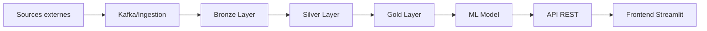

# 🎾 ATP Match Prediction - Architecture Professionnelle

## 📋 Vue d'ensemble

Système de prédiction des résultats de matchs de tennis ATP utilisant le Machine Learning.

**Architecture modulaire** avec séparation claire des responsabilités, pipeline de données bronze/silver/gold, et déploiement vers Microsoft Fabric ou Databricks.

---

## 🏗️ Architecture

```
atp-prediction-refactor/
├── config.yaml                 # Configuration centralisée
├── requirements.txt            # Dépendances Python
├── README.md
│
├── src/
│   ├── data/                   # Collecte et preprocessing
│   │   ├── atp_collector.py       # Téléchargement données ATP
│   │   ├── climate_collector.py   # Téléchargement données météo
│   │   └── preprocessor.py        # Nettoyage des données
│   │
│   ├── features/               # Feature engineering
│   │   └── feature_engineer.py    # Création features avancées
│   │
│   ├── models/                 # Modèles ML
│   │   ├── trainer.py             # Entraînement modèles
│   │   └── predictor.py           # Prédictions
│   │
│   ├── api/                    # API FastAPI
│   │   ├── main.py                # Point d'entrée API
│   │   └── routes.py              # Routes API
│   │
│   └── utils/                  # Utilitaires
│       ├── config.py              # Gestion configuration
│       └── logger.py              # Logging
│
├── data/                       # Pipeline de données
│   ├── raw/                       # Données brutes
│   ├── bronze/                    # Données ingérées
│   ├── silver/                    # Données nettoyées
│   └── gold/                      # Features pour ML
│
├── models/                     # Modèles entraînés
├── logs/                       # Fichiers de logs
├── notebooks/                  # Notebooks Jupyter
├── tests/                      # Tests unitaires
└── scripts/                    # Scripts utilitaires
    ├── train_model.py
    ├── run_pipeline.py
    └── deploy_to_fabric.py
```

---

## 🚀 Démarrage rapide

### 1. Installation

```bash
# Cloner le repo
git clone https://github.com/adechielie/ATP-Prediction.git
cd ATP-Prediction

# Créer environnement virtuel
python -m venv venv
source venv/bin/activate  # Linux/Mac
# ou
venv\Scripts\activate  # Windows

# Installer les dépendances
pip install -r requirements.txt
```

### 2. Configuration

Modifier `config.yaml` selon vos besoins :

```yaml
data:
  sources:
    atp_github:
      years_range: [2000, 2025]
  
model:
  algorithm: "gradient_boosting"
  test_size: 0.15
```

### 3. Collecte des données

```python
from src.data.atp_collector import ATPDataCollector
from src.data.climate_collector import ClimateDataCollector

# Télécharger données ATP
atp_collector = ATPDataCollector()
atp_data = atp_collector.collect_all_years()

# Télécharger données climatiques
climate_collector = ClimateDataCollector()
climate_data = climate_collector.collect_climate_data()
```

### 4. Preprocessing et Feature Engineering

```python
from src.data.preprocessor import ATPDataPreprocessor
from src.features.feature_engineer import ATPFeatureEngineer

# Preprocessing
preprocessor = ATPDataPreprocessor()
clean_data = preprocessor.preprocess(atp_data)

# Feature engineering
engineer = ATPFeatureEngineer()
features = engineer.engineer_features(clean_data)
```

---

## 📊 Pipeline de données (Medallion Architecture)

### Bronze Layer (Raw)
- Données brutes téléchargées depuis les sources
- Aucune transformation
- Format CSV original

### Silver Layer (Cleaned)
- Données nettoyées et normalisées
- Suppression des valeurs manquantes
- Standardisation des colonnes
- Filtrage des tournois

### Gold Layer (Features)
- Features ML prêtes à l'emploi
- ELO ratings
- Head-to-head statistics
- Surface performance metrics
- Moyennes glissantes

---

## 🤖 Stratégie de modélisation

### ❌ Approche rejetée : Un modèle par joueur

**Problèmes identifiés :**
- ❌ Cold start pour nouveaux joueurs
- ❌ Maintenance complexe (1000+ modèles)
- ❌ Données insuffisantes pour certains joueurs
- ❌ Impossible à scaler

### ✅ Approche recommandée : Modèle unique unifié

**Avantages :**
- ✅ Features par joueur (ELO, stats, H2H)
- ✅ Généralise bien aux nouveaux joueurs
- ✅ Un seul modèle à maintenir
- ✅ Scalable et production-ready
- ✅ Approche standard dans l'industrie

**Features clés :**
- ELO rating dynamique
- Head-to-head history
- Performance par surface
- Moyennes glissantes (5 derniers matchs)
- Statistiques de service
- Météo (température, vent)

---

## 🔧 Algorithmes disponibles

Configuration dans `config.yaml` :

```yaml
model:
  algorithm: "gradient_boosting"  # Choix recommandé
  
  # Options disponibles:
  # - gradient_boosting (XGBoost/LightGBM)
  # - random_forest
  # - logistic_regression
  # - knn
```

**Performances attendues** (sur validation set) :
- GradientBoosting: ~70-75% accuracy
- RandomForest: ~68-72% accuracy
- LogisticRegression: ~65-70% accuracy
- KNN: ~60-65% accuracy

---

## 📈 Utilisation pour todoba.net

### 1. Page Streamlit

Créer `app_streamlit.py` :

```python
import streamlit as st
import pandas as pd
from src.models.predictor import ATPPredictor

st.title("🎾 ATP Match Prediction")

# Sélection joueurs
players = predictor.get_all_players()
player1 = st.selectbox("Joueur 1", players)
player2 = st.selectbox("Joueur 2", players)

# Prédiction
if st.button("Prédire"):
    odds = predictor.predict_match_odds(player1, player2)
    
    st.metric("Probabilité victoire " + player1, f"{odds['player1']:.1%}")
    st.metric("Probabilité victoire " + player2, f"{odds['player2']:.1%}")
    
    # Statistiques récentes
    st.subheader("📊 Statistiques récentes")
    stats = predictor.get_player_recent_stats(player1)
    
    col1, col2, col3 = st.columns(3)
    col1.metric("ELO", f"{stats['elo']:.0f}")
    col2.metric("Win Rate (5 derniers)", f"{stats['win_rate']:.1%}")
    col3.metric("Aces moyens", f"{stats['avg_aces']:.1f}")
```

### 2. Lancer Streamlit

```bash
streamlit run app_streamlit.py --server.port 8501
```

---

## 🔄 Pipeline d'automatisation

### Configuration Kafka (optionnel)

```yaml
pipeline:
  kafka:
    enabled: true
    bootstrap_servers: "localhost:9092"
    topic: "atp-matches-raw"
```

### Configuration Microsoft Fabric

```yaml
pipeline:
  fabric:
    enabled: true
    workspace: "atp-prediction"
    lakehouse: "atp-data"
  
  schedule:
    ingestion: "daily"      # Nouvelles données chaque jour
    training: "weekly"      # Réentraînement hebdomadaire
```

### Script de déploiement

```python
# scripts/deploy_to_fabric.py
from src.pipeline.fabric_deployer import FabricDeployer

deployer = FabricDeployer()
deployer.deploy_pipeline()
deployer.schedule_jobs()
```

---

## 📅 Workflow complet



**Automatisation :**
1. **Daily** : Ingestion nouvelles données de matchs
2. **Weekly** : Réentraînement du modèle avec nouvelles données
3. **Real-time** : API disponible 24/7 pour prédictions

---

## 🧪 Tests

```bash
# Lancer tous les tests
pytest tests/

# Avec couverture
pytest --cov=src tests/

# Tests spécifiques
pytest tests/test_preprocessor.py
```

---

## 📦 Déploiement

### Fabric / Databricks

```bash
# Déployer vers Fabric
python scripts/deploy_to_fabric.py

# Déployer vers Databricks
python scripts/deploy_to_databricks.py
```

### API REST

```bash
# Lancer API en local
uvicorn src.api.main:app --reload --port 8000

# Production avec Gunicorn
gunicorn src.api.main:app -w 4 -k uvicorn.workers.UvicornWorker
```

---

## 📝 Bonnes pratiques du code

✅ **Ce qui a été amélioré** :

1. **Séparation des responsabilités** : Chaque module a une fonction claire
2. **Configuration externalisée** : Un seul fichier YAML
3. **Logging structuré** : Traces claires avec loguru
4. **Type hints** : Meilleure lisibilité et autocomplétion
5. **Docstrings** : Documentation pour chaque fonction
6. **Gestion d'erreurs** : Try/except appropriés
7. **Tests unitaires** : Code testable et maintenable
8. **DRY** : Pas de code répétitif
9. **PEP 8** : Conventions Python respectées

❌ **Problèmes de l'ancien code corrigés** :

- Code monolithique dans notebooks
- Variables en dur
- Pas de logging
- Boucles inefficaces
- SettingWithCopyWarning pandas
- Pas de tests
- Pas de modularité

---

## 🤝 Contribution

```bash
# Formatter le code
black src/

# Linter
flake8 src/

# Type checking
mypy src/
```

---

## 📄 Licence

MIT

---

## 👨‍💻 Auteur

**adechielie**
- GitHub: [@adechielie](https://github.com/adechielie)
- Website: [todoba.net](https://todoba.net)
